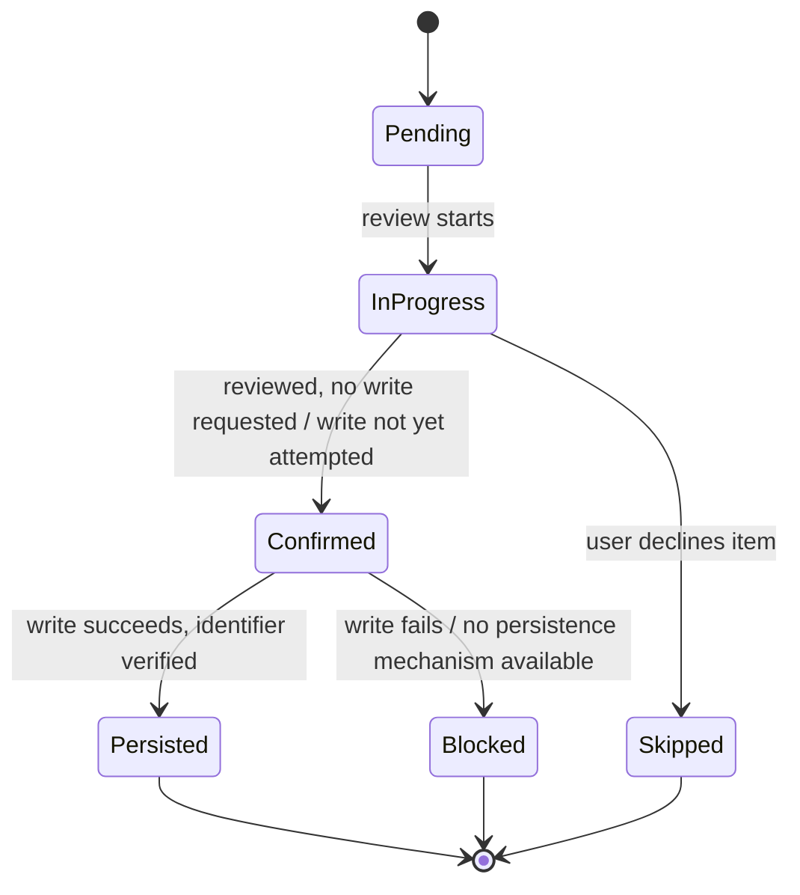

# Braindump intake

Converts a free-form, multi-item braindump into a numbered ledger of atomic outcomes, reviews the
ledger one item at a time with the user, and — when the user asks for durable records — hands
confirmed items to whatever task or capture mechanism is available, accepting only identifiers that
mechanism verifies. The skill owns the intake conversation, item ordering, and ledger state; it
deliberately does not own destinations, schemas, or identifier formats, which belong to the
persistence workflow it hands off to.

## Status

Active. Per [`install.conf.sample`](../install.conf.sample):

```
braindump-intake        claude codex agents
```

This is the default mapping for all three harness roots (Claude Code, Codex, and the neutral
`~/.agents/skills` root) — the skill is not restricted to a subset of harnesses.

The skill is model-triggered: its `description` frontmatter is the sole trigger mechanism (per
[`AGENTS.md`](../AGENTS.md)), so an agent invokes it automatically when a user message matches the
description below. It has no companion slash command or script the user runs directly.

## Triggers

Per the `description` frontmatter in [`SKILL.md`](../braindump-intake/SKILL.md), the skill applies
when the user:

- dumps multiple ideas, requests, follow-ups, or project changes in one message and wants them
  decomposed or reviewed one at a time;
- says "brain dump" or "here's everything on my mind";
- pastes a messy mixed list of tasks and ideas;
- asks for quick versus guided intake;
- is on mobile and asks the agent to restate the full ledger mid-intake.

## Prerequisites

- No external tools, authentication, or network access are required by the skill itself.
- Durable persistence (writing a task, ticket, or note) requires a separate persistence tool or
  companion skill to be available in the session. The skill explicitly does not bundle one — see
  "Bundled resources" below — and functions correctly with none available, returning a normalized
  handoff instead of inventing a write.
- No other skill is a hard dependency. The worked-example reference mentions generic "task" and
  "capture" mechanisms without naming a specific companion skill.

## Read/write and safety boundaries

- **Reads:** the user's braindump text; any durable reference the user supplies (for example a
  ticket or note identifier) for validation through its owning workflow; cheap local evidence such
  as repository instructions or a named prior implementation, gathered only when it improves the
  next review decision.
- **Writes:** nothing directly. The skill never performs a persistence write itself — it routes a
  confirmed item to an external task or capture mechanism and records only the identifier that
  mechanism returns or verifies.
- **External/human-facing effects:** any actual creation or repair of a ticket, note, or record
  happens inside the delegated persistence workflow, not this skill.
- **Requires explicit confirmation before acting:** every item, in both modes, before it is routed
  for persistence — the skill states a one-shot exception (see "One-shot vs guided flows" below)
  but even there restricts itself to outcomes, writes, and destinations the user stated
  unambiguously, flagging remaining ambiguity in the final report instead of persisting a guess.
  Batch-writing unconfirmed items is explicitly disallowed.

## Typical workflow

1. **Initialize.** Unless the user has already picked a mode, the agent asks whether to use Quick
   or Guided detail by default (per-item overrides are allowed). A one-shot request ("no questions,
   just process this") is treated as an implicit Quick-mode selection.
2. **Build the ledger.** The dump is split into one numbered item per atomic outcome. An explicitly
   requested final meta-item (for example, "and capture improvements to this intake process itself")
   stays last; later additions are inserted before it. The agent mirrors the ledger in its own
   plan/todo UI when one is available.
3. **Process items one at a time**, keeping exactly one item `In progress`:
   - **Preflight** — validate any supplied durable reference through its owning workflow; surface
     validation failures rather than guessing, adding a distinct repair item when needed.
   - **Review** — Quick mode proposes a short name and one-sentence outcome; Guided mode asks one
     scope-changing decision question per turn. The user can decline an item, which is marked
     `Skipped` with a reason.
   - **Route or hand off** — if no persistence was requested, mark the item `Confirmed`. If
     persistence was requested, route it to the applicable task or capture mechanism, repair an
     existing broken record in place where supported, or — if no mechanism is available — produce a
     normalized handoff (see below) and mark the item `Blocked` with the missing capability.
   - **Update the ledger** — attach only an identifier actually returned or verified, then mark the
     item `Persisted`; keep failed writes `Blocked` and unpersisted reviewed items `Confirmed`.
4. **Close the intake** once every item is `Confirmed`, `Persisted`, `Blocked`, or `Skipped`, and
   report the final ledger, persisted identifiers and outcomes, handoffs, blockers, repairs, and
   skipped items. A planned filename or identifier is never reported as already created.

### Normalized handoff contract

When no persistence mechanism is available for a confirmed item, the skill returns a handoff
containing: the confirmed title, the outcome, requirements, relevant context, and the intended
artifact type — and marks the item `Blocked` with the missing capability named. This is the only
shape in which the skill hands off unwritten work; it never invents a destination, filename, or
identifier to stand in for a real write.

### One-shot vs guided flows

- **Guided** reviews one scope-changing decision question at a time per item before confirming
  it. Neither mode is a standing default: the skill asks which to use unless the user already
  chose one.
- **Quick** confirms a short name and one-sentence outcome per item, without a decision question.
- **One-shot** is a variant reachable from either mode: when the user cannot or will not answer
  questions ("no questions, just process this"), the agent falls back to Quick mode and treats the
  request itself as confirmation — but only for the outcomes, writes, and destinations it states
  unambiguously. Anything else is flagged in the final report rather than assumed.

Per-item mode overrides are allowed within a single intake session in any of these flows.

## Bundled resources

- [`SKILL.md`](../braindump-intake/SKILL.md) — the full procedure: ledger states, the review loop,
  the normalized handoff contract, and the mobile-restatement rule.
- [`references/worked-example.md`](../braindump-intake/references/worked-example.md) — a synthetic
  scenario used to calibrate or forward-test the interaction shape (reference repair, cheap context
  gathering, one-question reviews, backend-neutral persistence, a preserved final meta-item). The
  skill file itself states its names and identifiers (e.g. `PROJECT-DEMO`, `WORK-201`, `NOTE-044`)
  are fictional and must not be reused as real content in a future braindump.
- [`agents/openai.yaml`](../braindump-intake/agents/openai.yaml) — optional OpenAI-interface
  metadata (display name, short description, default prompt) for harnesses that consume that
  format. It is not part of the backend-neutral core procedure in `SKILL.md` and is not required
  for the skill to function on Claude Code or the neutral `~/.agents/skills` root.

## Ledger state-transition reference

The per-line ledger uses exactly six states. Every numbered line must show its own current state;
a collective claim like "all four persisted" is disallowed because it hides per-item drift.

| State | Entered when | Notes |
| --- | --- | --- |
| `Pending` | Item is added to the ledger and not yet being reviewed. | Initial state for every new item. |
| `In progress` | The item is the one currently being reviewed or acted on. | Exactly one item is `In progress` at a time; an item the current reply is reviewing or acting on is already `In progress`, not `Pending`. |
| `Confirmed` | Review completes and either no persistence was requested, or persistence was requested but the write has not yet happened. | Also the resting state for an unpersisted but reviewed item after an update step. |
| `Persisted` | A write succeeds and the persistence workflow returns or verifies an identifier. | Only an identifier actually returned or verified may be attached — never a planned or guessed one. |
| `Blocked` | A persistence write fails, or no persistence mechanism is available for a requested write. | Reserved for persistence-side failures. **Not** used for an item whose underlying work merely lacks inputs (data, access, a decision) — that item is still reviewable: confirm it and note what the work will need, rather than blocking it. |
| `Skipped` | The user declines to pursue the item during review. | The reason is noted for the final report. |

Intake closes only when every item is in one of `Confirmed`, `Persisted`, `Blocked`, or `Skipped`.



## Limitations

- The skill has no way to perform a persistence write on its own; every durable record depends on
  an external mechanism being present in the session. Without one, every item that requests
  persistence ends the intake `Blocked`.
- It does not resolve which persistence backend to use when more than one is plausible — it surfaces
  the choice to the user rather than picking one.
- It intentionally avoids becoming an audit tool: "cheap local evidence" gathering during preflight
  is bounded, and repository surveys are treated as preparation rather than automatically durable
  work.
- No automated test harness, script, or eval is bundled with the skill (unverified beyond what is
  described in "Verification status" below).

## Compatibility and version notes

- The default harness mapping (`claude codex agents`, i.e. all three roots) is read directly from
  `install.conf.sample` as of 2026-07-21; confirm this still matches before relying on it, since a
  machine's local `install.conf` can diverge from the sample.
- `agents/openai.yaml` targets an OpenAI-interface convention (`interface.display_name`,
  `short_description`, `default_prompt`); this is a metadata contract for harnesses that read that
  file, not a Claude Code or Codex mechanism, and its shape is not otherwise documented in this
  repository as of 2026-07-21.
- The skill has no pinned dependency on a specific agent/model version; its only mechanism is the
  `description` frontmatter trigger, which is harness-interpreted.

## Verification status

- No automated tests, CI checks, or eval scripts for this skill were found under its directory or
  elsewhere in the repository at the time of writing.
- The procedure was verified by reading `SKILL.md` and `references/worked-example.md` in full; the
  worked example is explicitly synthetic and is a calibration aid, not a captured transcript or a
  test fixture with assertions.
- The example below is illustrative only, not a real captured transcript.

## Example (illustrative)

```text
User: brain dump — add dark mode, fix the flaky login test, and look into why exports are slow.
      Also capture an idea to improve this intake process itself, at the end.

Agent: Which detail level should I use by default?
       1. Quick — confirm a short name and one-sentence outcome, then move on.
       2. Guided — review one decision question at a time and capture richer requirements.

User: Quick.

Agent: Ledger:
       1. [Pending] Add dark mode
       2. [Pending] Fix flaky login test
       3. [Pending] Investigate slow exports
       4. [Pending] Capture: improve this intake process (final meta-item)

       Item 1 [In progress]: "Add dark mode" — user-facing theme toggle, persisted as a task. Confirm?

User: yes

Agent: Item 1 [Persisted] as WORK-410 (illustrative identifier).
       Item 2 [In progress]: "Fix flaky login test" — persisted as a task. Confirm?
       ...
```
